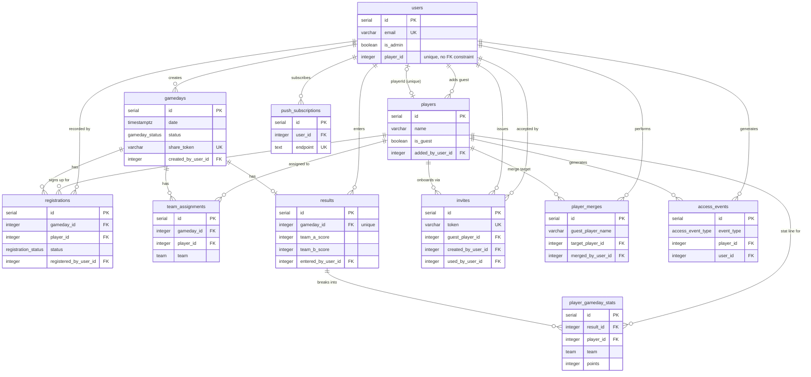

# Data model

Postgres via Drizzle ORM. Source of truth: `backend/src/db/schema.ts`; migrations
live in `backend/drizzle/` (current head: `0007_lively_freak.sql`). This document
should be updated whenever a table, column, or relationship changes — see
`docs/ARCHITECTURE.md` and `CLAUDE.md`'s Documentation section.

## Relationship map

## Enums

| Enum | Values |
| --- | --- |
| `gameday_status` | `OPEN`, `CLOSED`, `CANCELLED`, `COMPLETED` |
| `registration_status` | `CONFIRMED`, `WAITLISTED`, `CANCELLED` |
| `team` | `A`, `B` |
| `access_event_type` | `LOGIN`, `GUEST_REGISTER`, `APP_OPEN` |

Note: `gameday_status.OPEN` past kickoff with no result reads as `CLOSED`
everywhere — this is computed on read (`effectiveGamedayStatus`, see
`docs/ARCHITECTURE.md`), never written back to the row.

## Tables

### Identity & access

**`users`** — a login account.

| Column | Type | Notes |
| --- | --- | --- |
| `id` | serial | PK |
| `email` | varchar(255) | unique, nullable — login is by player name, not email |
| `password_hash` | text | |
| `is_admin` | boolean | |
| `player_id` | integer | unique, nullable — **no DB-level FK**, unlike every other reference in this schema |
| `created_at`, `updated_at` | timestamptz | |

**`players`** — anyone who can appear on a roster: a real account's profile,
or a guest with no login.

| Column | Type | Notes |
| --- | --- | --- |
| `id` | serial | PK |
| `name` | varchar(255) | |
| `is_guest` | boolean | |
| `added_by_user_id` | integer | FK → `users.id` |
| `avatar_data` | text | |
| `avatar_mime_type` | varchar(100) | |
| `created_at` | timestamptz | |

Onboarding an invite flips `is_guest` to `false` on the existing row — it
never creates a second player.

### Matchdays & registration

**`gamedays`** — one Thursday session.

| Column | Type | Notes |
| --- | --- | --- |
| `id` | serial | PK |
| `date` | timestamptz | |
| `min_players`, `max_players` | integer | defaults 8 / 14 |
| `status` | `gameday_status` | see the computed-status note above |
| `notes` | text | |
| `share_token` | varchar(64) | unique, nullable — generated lazily on first share |
| `created_by_user_id` | integer | FK → `users.id`, not null |
| `created_at`, `updated_at` | timestamptz | |

**`registrations`** — a player's signup for a gameday.

| Column | Type | Notes |
| --- | --- | --- |
| `id` | serial | PK |
| `gameday_id` | integer | FK → `gamedays.id`, cascade delete |
| `player_id` | integer | FK → `players.id` |
| `status` | `registration_status` | |
| `signup_at`, `cancelled_at` | timestamptz | |
| `registered_by_user_id` | integer | FK → `users.id` |

Unique on `(gameday_id, player_id)` — cancelling and re-registering reuses
the same row.

**`team_assignments`** — which team (A/B) a player is on for a gameday.

| Column | Type | Notes |
| --- | --- | --- |
| `id` | serial | PK |
| `gameday_id` | integer | FK → `gamedays.id`, cascade delete |
| `player_id` | integer | FK → `players.id` |
| `team` | `team` | |

Unique on `(gameday_id, player_id)`.

### Results & stats

**`results`** — the final score for a gameday.

| Column | Type | Notes |
| --- | --- | --- |
| `id` | serial | PK |
| `gameday_id` | integer | FK → `gamedays.id`, unique, cascade delete — one result per gameday |
| `team_a_score`, `team_b_score` | integer | |
| `entered_by_user_id` | integer | FK → `users.id` |
| `created_at`, `updated_at` | timestamptz | |

**`player_gameday_stats`** — a precomputed points/goal-diff snapshot per
player per gameday, feeding standings and Hall of Fame.

| Column | Type | Notes |
| --- | --- | --- |
| `id` | serial | PK |
| `result_id` | integer | FK → `results.id`, cascade delete |
| `player_id` | integer | FK → `players.id` |
| `team` | `team` | |
| `points` | integer | |
| `goal_diff` | integer | |

Unique on `(result_id, player_id)`. Precomputed, not derived at query time —
a scoring-rule change needs a backfill (see `backend/src/utils/scoring.ts`).

### Onboarding & roster upkeep

**`invites`** — admin-issued onboarding links. Every invite starts from an
existing guest player, promoted (`is_guest → false`) the moment the invite
is created, not at accept-time.

| Column | Type | Notes |
| --- | --- | --- |
| `id` | serial | PK |
| `token` | varchar(64) | unique — stored in plaintext so an admin can re-copy an unused link |
| `note` | varchar(255) | |
| `guest_player_id` | integer | FK → `players.id`, cascade delete, not null |
| `created_by_user_id` | integer | FK → `users.id` |
| `used_by_user_id` | integer | FK → `users.id`, nullable |
| `expires_at`, `used_at`, `revoked_at` | timestamptz | |
| `created_at` | timestamptz | |

**`player_merges`** — an audit log for guest-into-player merges, not a live
link. The guest row is deleted once merged, so its name and the exact moved
row ids are captured here — that's what makes undo possible.

| Column | Type | Notes |
| --- | --- | --- |
| `id` | serial | PK |
| `guest_player_name` | varchar(255) | snapshot — the guest row is gone |
| `target_player_id` | integer | FK → `players.id`, cascade delete |
| `merged_by_user_id` | integer | FK → `users.id` |
| `moved_registration_ids` | text (json) | |
| `moved_team_assignment_ids` | text (json) | |
| `moved_stat_ids` | text (json) | |
| `undone_at`, `created_at` | timestamptz | |

### Engagement & usage metrics

**`push_subscriptions`** — one row per browser/device a user has enabled
Web Push notifications on.

| Column | Type | Notes |
| --- | --- | --- |
| `id` | serial | PK |
| `user_id` | integer | FK → `users.id`, cascade delete |
| `endpoint` | text | unique |
| `p256dh`, `auth` | text | |
| `created_at` | timestamptz | |

**`access_events`** — usage metrics, meant to be queried directly (e.g. from
Metabase) rather than through the app. See README's "Usage metrics" section
for example queries and the read-only role setup.

| Column | Type | Notes |
| --- | --- | --- |
| `id` | serial | PK |
| `occurred_at` | timestamptz | |
| `event_type` | `access_event_type` | `LOGIN`, `GUEST_REGISTER`, or `APP_OPEN` |
| `is_guest` | boolean | |
| `player_id` | integer | FK → `players.id`, `ON DELETE SET NULL` |
| `player_name` | varchar(255) | denormalized snapshot, survives player deletion/rename |
| `user_id` | integer | FK → `users.id`, `ON DELETE SET NULL`; null for guests |
| `os`, `browser` | varchar(32) | parsed from `User-Agent` (`backend/src/utils/userAgent.ts`) |
| `device_type` | varchar(16) | `mobile` / `tablet` / `desktop` |
| `is_pwa` | boolean, nullable | null when the client sent no `X-Standalone` header, distinct from a real "opened in a browser" `false` |
| `user_agent` | text | raw string, kept in case a classification needs revisiting |

`LOGIN` only fires on an actual credentials submit (undercounts real usage
once a JWT is cached — 7-day default expiry). `APP_OPEN` fires on every
`GET /auth/me` instead, once per app load/PWA launch regardless of token
age — use it for "how often is the app actually used".
